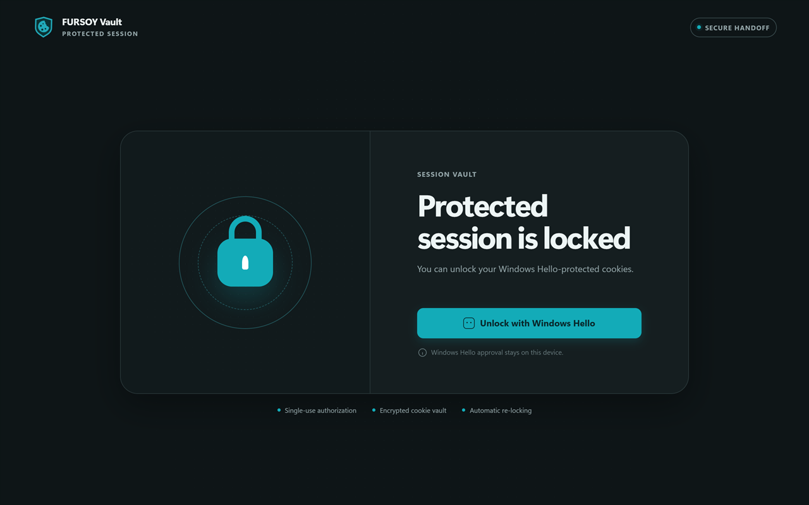

# FURSOY Vault

**[Install from the Chrome Web Store](https://chromewebstore.google.com/detail/fursoy-vault/ibjddphkjppgkdbegjibddbjkagdlaea)** ·
[fursoy.com](https://fursoy.com) ·
[Releases](https://github.com/FURSOY/fursoy-vault/releases)

The extension needs a companion app on the same machine:
[Windows](https://github.com/FURSOY/fursoy-vault/releases/latest/download/FURSOY-Vault-Setup.exe) ·
[Linux](https://github.com/FURSOY/fursoy-vault/releases/latest/download/fursoy-vault-linux-x86_64.tar.gz)



FURSOY Vault is a session-cookie vault for Chromium browsers on Windows and Linux. It removes
cookies for sites the user explicitly protects, stores them encrypted behind the machine's TPM, and
restores them after a fresh user verification — Windows Hello on Windows, a TPM-held PIN on Linux.
It is deliberately narrower than a password manager or a general browser-security suite: it protects
browser cookie sessions, not localStorage, IndexedDB, service-worker state, downloaded files,
passwords, or a compromised user account.

The product has four policies: Critical, Balanced and Convenient actively vault cookies; Monitor
only records best-effort signals and never mutates browser state. Monitoring is detection, not an
EDR or process blocker. Each regular browser profile receives an isolated vault namespace;
incognito is unsupported.

The extension ships a fixed id, so the single Chrome Web Store package also runs in Edge, Brave,
Vivaldi and other Chromium browsers on both platforms. On Windows the installer registers the
Native Messaging host under each browser's key; on Linux `register.sh` writes the equivalent
manifest into each browser's directory. Firefox and Safari are not supported — they use a different Native
Messaging registration model.

Chrome profiles are intentionally isolated and a vault can never be listed, copied or claimed by
another profile. Clearing extension storage or uninstalling the extension therefore makes that
profile's existing vault unavailable; no automatic cross-profile recovery or escrow path exists.

## Build and verify

Windows:

```text
cd extension
npm ci
npm run package

cd ..\native-host
cargo fmt --all -- --check
cargo clippy --locked --all-targets -- -D warnings
cargo test --release --locked
dotnet tool install --global vpk --version 1.2.0
powershell -File install/package-release.ps1
```

Linux:

```text
cd extension
npm ci
npm run package

cd ../native-host
cargo fmt --all -- --check
cargo clippy --locked --all-targets -- -D warnings
cargo test --release --locked
bash install/linux/package-release.sh
```

Acceptance coverage and the hardware/manual rows are documented in `tests/acceptance/MATRIX.md`.

### Running the Linux tests

The Linux backends hold their keys in the TPM, so their tests need one, and they must not run in
parallel:

```text
cargo test --lib -- --include-ignored --test-threads=1
```

A TPM has very few transient object slots — three on the reference simulator — and every load
consumes one. Cargo's default parallelism exhausts them immediately and the run fails with
out-of-memory errors that point nowhere near the real cause. This is a test-only constraint: the
instance lock means exactly one host process ever touches the TPM, and it does so one operation at
a time.

Against a software simulator rather than real hardware, start `swtpm` and add
`--features tpm-simulator` with `FCP_TPM_TCTI` set. Without that feature the backends refuse
anything but a TPM character device, so a release build cannot be pointed at a simulator by
accident.

## License and source

Copyright contributors. Licensed under GPL-3.0-only; see `LICENSE`. Release assets include both the
license and `SOURCE.txt`, which identifies the matching complete source tag and build procedure.

## Privacy

FURSOY Vault operates locally and does not collect telemetry or transmit vault contents to the
project maintainer. See the full [privacy policy](PRIVACY.md).

## Code signing policy

Windows release binaries follow the [project code signing policy](CODE_SIGNING_POLICY.md). The
Windows companion is currently unsigned and may show **Unknown publisher**. Every release includes
SHA-256 checksums and is built, tested, and published from a version tag by GitHub Actions; see the
[release process](docs/RELEASING.md). Linux has no equivalent publisher gate; that archive is
reproducible for a given tag, so its published checksum can be reproduced from source.

## Support the project

FURSOY Vault is built and maintained by one person and published under GPL-3.0. There is no
company behind it and no telemetry to monetise.

The one thing money would change today is **code signing**. A Windows code-signing certificate
costs a few hundred dollars a year, which the project does not currently cover. Until it does,
every installer shows an *Unknown publisher* warning — the single biggest reason people abandon
setup, and a real obstacle for a tool that asks to handle your session cookies. Sponsorship goes
to that certificate first.

If the project is useful to you, [sponsoring it on GitHub](https://github.com/sponsors/FURSOY)
helps. If it is not useful to you, filing a clear bug report helps just as much.
